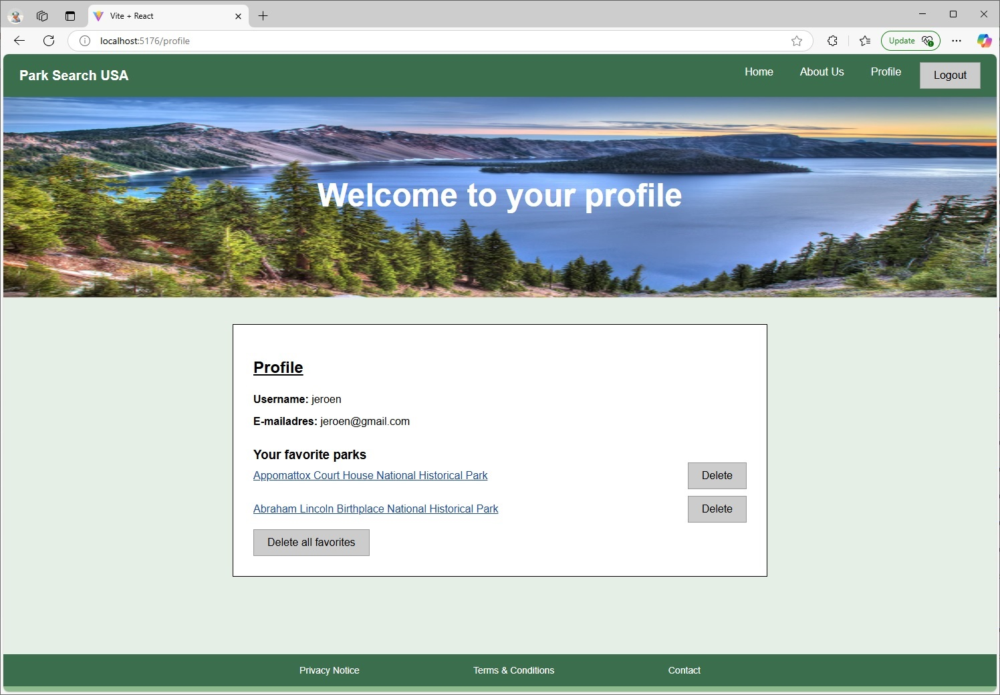

National Parks USA - React Applicatie

### **1. Inleiding**

Deze React-applicatie helpt gebruikers bij het vinden van nationale parken in de Verenigde Staten op basis van hun voorkeuren. Bezoekers kunnen:

Tot 5 Amerikaanse staten selecteren

Tot 5 voorzieningen selecteren (zoals toiletten, parkeerplaatsen, picknicktafels, etc.)

Een overzicht krijgen van bijbehorende parken

Parkdetails bekijken inclusief beschrijving, openingsuren en activiteiten

Favoriete parken opslaan op hun profielpagina (met localStorage)

Inloggen en registreren via een externe backend met JWT-authenticatie

Hieronder een screenshot van de profielpagina

**2. Benodigdheden**

Om deze applicatie lokaal te draaien heb je het volgende nodig:

Software:

- Node.js

- npm

- Webstorm

### API & externe services:

NPS API (https://www.nps.gov/subjects/developer/api-documentation.htm)

Maak een developer account aan en verkrijg een API key

Voeg de API key toe in een .env bestand in de root van je project:

VITE_NPS_API_KEY=your_api_key_here

Voor de docent: API Key = 4e9guR4vuo309ZouUkz4QwS6OKmpACSvzqh2i3cu

Externe backend: https://frontend-educational-backend.herokuapp.com/api

Wordt gebruikt voor registratie, login, en JWT authenticatie

**3. Installatie-instructies**

Volg onderstaande stappen om de applicatie lokaal op te zetten en te draaien:

### Stap 1: Installeer Node.js en npm

1.1 Node.js installeren

Ga naar https://nodejs.org/ en kies de LTS-versie.

Volg de stappen van de installatie-wizard.

Open daarna de terminal en test of het werkt door onderstaande in de terminal te typen:

node -v
npm -v

Je krijgt dan 2 versienummers te zien. Is dat niet zo? Installeer dan Node.js opnieuw.

1.2 Test Node.js met een eerste bestand

Maak in je project een bestand aan, bijvoorbeeld voorbeeld.js, en zet daar deze code in:

console.log("Hoera, hij doet het!");
Voer het uit in de terminal met:

node voorbeeld.js
Je ziet nu de tekst in de terminal verschijnen. Node.js werkt dus!

1.3 (Optioneel) Nodemon installeren

Als je niet elke keer node bestand.js wilt typen bij wijzigingen, installeer dan nodemon:

npm install -g nodemon
Start het bestand met:

nodemon voorbeeld.js
Elke keer als je het bestand opslaat, zie je automatisch de nieuwe uitvoer in je terminal.

Let op: Deze installatie is eenmalig, behalve als je later op een nieuwe computer werkt.

### Stap 2: Clone de repository 

git clone git@github.com:Trun97/parksearch.git (SSH)

of via: https://github.com/Trun97/parksearch.git

### **Stap 3: Installeer alle benodigde packages**

Open daarna de terminal en en installeer npm door onderstaande in de terminal te typen:

npm install

### **Stap 4: Maak een .env bestand aan in de root directory**

VITE_NPS_API_KEY=hier_jouw_api_key

### **Stap 5: Start browser**

npm run dev

De applicatie zal draaien op http://localhost:5173

**Onderstaande dependencies heb je ook nodig:**
 - react-router-dom
 - axios
 - jwt-decode

Ga naar je terminal en run de volgende commando's 1 voor 1.
 - npm install react-router-dom
 - npm install axios
 - npm install jwt-decode

### **4. Overige handige npm commando's**

 - npm run build--- Maakt een bundel (in de map dist) om je app online te kunnen zetten.
 - npm run preview---	Start je app lokaal op basis van de productie-build in dist.
 - npm run lint---	Laat een linter draaien die je helpt bij het opsporen van fouten en inconsistenties in je code.

